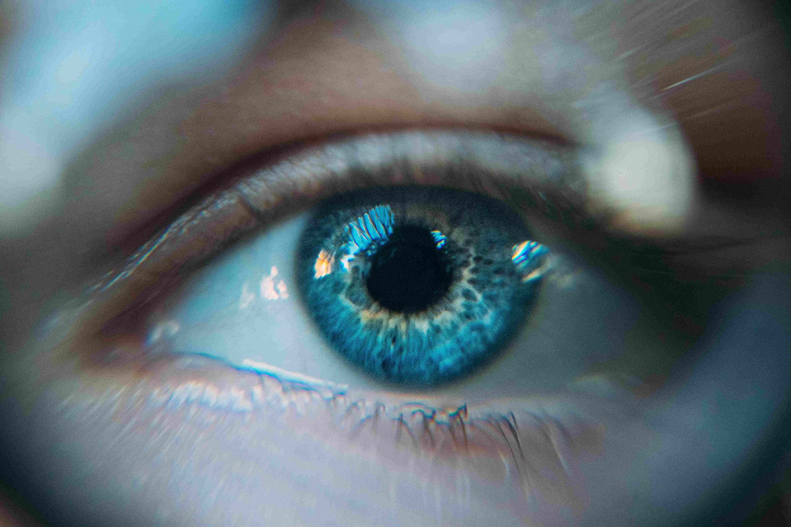

// First and foremost:
// Remember to change this!
:author: Your full name
:doctitle: Title of the presentation
:email: info@vshn.ch
:producer: VSHN AG
:creator: VSHN AG
:revnumber: 1.0
:copyright: CC-BY-SA 3.0

// Other standard Asciidoctor attributes:
// https://asciidoctor.org/docs/user-manual/#builtin-attributes
:revdate: {docdate}
:icons: font
:icon-set: fi
:hide-uri-scheme:
:source-highlighter: highlightjs

// Reveal.js-specific attributes:
// https://asciidoctor.org/docs/asciidoctor-revealjs/#reveal-js-options
:revealjsdir: node_modules/reveal.js
:revealjs_customtheme: theme/vshn.css
:revealjs_controls: false
:revealjs_controlsTutorial: false
:revealjs_transition: none
:revealjs_history: true
:revealjs_backgroundTransition: none

// The first slide is autogenerated with the information provided
// in the :author: and :doctitle: attributes entered at the very
// top of this file.
= Title

image::assets/images/vshn.png[]

// This is a comment!
== Bullet Points

// Make bulletpoints appear one by one
[%step]
* Foo
* Bar
* World

== Admonition Blocks

TIP: This is a tip

NOTE: This is a note

WARNING: This is a warning

CAUTION: You have been warned

IMPORTANT: This is very important

// No need to write down the numbers
== Numbered List

. First
. Second
. First

// The "!" is simply here to specify a slide without title
== !

Font Awesome icons: icon:tags[] icon:heart[size=2x]

Download: icon:download[link="https://handbook.vshn.ch/handbook.pdf"]

// These are speaker notes; hit "S" while the presentation is showing
// so that they appear in a separate browser window.
[.notes]
--
More icons here: https://fontawesome.com/icons?d=gallery&m=free
--

// Any CSS color will do the trick.
[background-color="black"]
== Black Background

Great for images

[.notes]
--
Remember to tell a nice anecdote and to make a point.
--

// Slide with Asciinema movie, available locally
== !

++++
<asciinema-player src="assets/casts/backup.cast" cols="86" rows="21" idle-time-limit="1" poster="npt:0:40" speed="1.1" font-size="medium" theme="tango"></asciinema-player>
++++

// Video slide
== Video

video::assets/videos/toast.mp4[]

// Slide with some source code, including highlighting.
// You do not need to paste the code here, you can insert it here
// directly from an external file.
== Code

[source,yaml]
----
include::assets/code/stuff.yml[]
----

[.coverimage]
== Slide with a Background image

* This is a list in in a slide with a background image
* Make your cover images wide enough (in pixels) and light enough (below 1 MB)

== Thanks!

image::assets/images/appuio.png[]

your.email@vshn.ch

link:slides.pdf[Download this presentation!]

[.notes]
--
Ask your audience to download these slides!
--

// Inserting some JavaScript and some CSS in the final product
// so that Asciinema movies can work.
++++
<link rel="stylesheet" href="node_modules/asciinema-player/resources/public/css/asciinema-player.css">

++++
